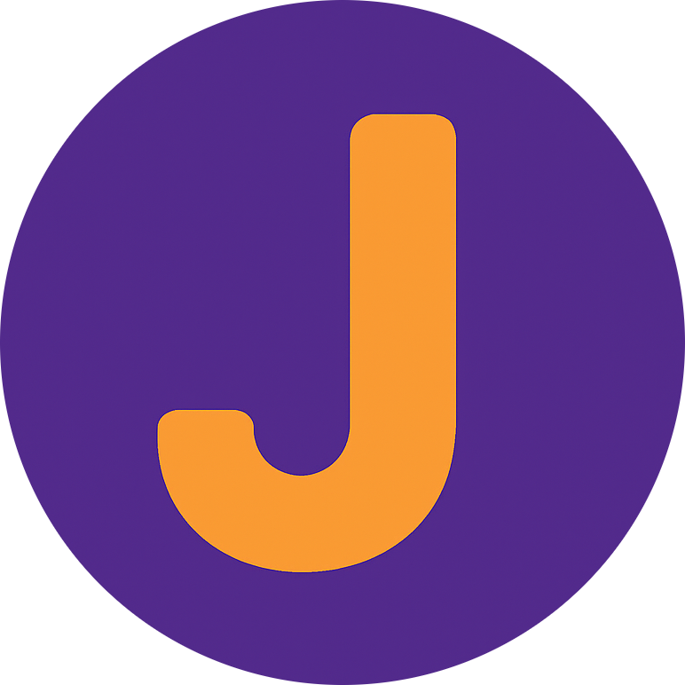

  
# Jam: A Friendly, Expressive Language for All Developers

> **Jam** is a beginner-friendly programming language with a readable, English-like syntax that compiles to JavaScript. Designed to be simple enough for newcomers and powerful enough for professionals.
  


---

## Table of Contents

- [Why Jam?](#why-jam)
- [Quick Start](#quick-start)
- [Your First Jam Program](#your-first-jam-program)
- [Language Guide](#language-guide)
  - [Variables](#variables)
  - [Control Flow](#control-flow)
  - [Loops](#loops)
  - [Functions](#functions)
  - [Operations](#operations)
  - [Utilities](#utilities)
- [Architecture](#architecture)
- [Vision](#vision)
- [Contributing](#contributing)
- [Areas We Need Help With](#areas-we-need-help-with)
- [Development Setup](#development-setup)
- [License](#license)
- [Acknowledgments](#acknowledgments)
- [Support](#support)

---

## Why Jam?

### For Beginners

- **Intuitive Syntax** — English-like commands that make sense right away  
- **Beginner-Friendly Learning Curve** — No complex symbols or obscure syntax  
- **Interactive Feedback** — Built-in interpreter for immediate results  
- **Helpful Guidance** — Get warnings and tips as you learn  

### For Professionals

- **Type Inference** — Smart type detection and warning system  
- **Modern Features** — Functions, lambdas, maps, timers, and more  
- **Extensible Architecture** — Easily add new features or tools  

---

## Quick Start

### Installation

```bash
# Clone the repository
git clone https://github.com/UnitaryIron/Jam-Backend.git
cd Jam-Backend

# Install dependencies
pip install -r requirements.txt
```

## Your First Jam Program

### Create a file called hello.jam:

```jam
# Welcome to Jam!
say "Hello, World!"
```
Run with the Jam interpreter:
```python
python jam.py hello.jam
```

## Language Guide

### Variables
```jam
set message = "Hello Jam!"
set count = 42
set pi = 3.14159
set is_active = true
set numbers = [1, 2, 3, 4, 5]
```

### Control Flow
```jam
# Basic variable assignment and arithmetic
set x = 10
set y = 5
set name = "Alice"

# Conditional logic
if x > y {
    print "x is greater than y"
} else if x < y {
    print "x is less than y"
} else {
    print "x equals y"
}
```

### Loops
```jam
repeat 5 {
    print "This will print 5 times"
}
```

### Functions

Named function:
```jam
function greet (name) {
    add "Hello, " and name into message
    print message
    return message
}
```

Anonymous function (lambda):
```jam
function anonymous (x, y) {
    add x and y into result
    return result
}
```

Calling functions:
```jam
call greet("World")
set sum_result = call anonymous(5, 7)
print sum_result
```

### Operations

Math operations:
```jam
# Basic arithmetic
set a = 15
set b = 3

add a and b into sum
print sum

multiply a and b into product
print product

# Math functions
square of a into a_squared
print a_squared

sqrt of 64 into root
print root

# Random numbers
random between 1 and 100 into lucky_number
print lucky_number
```

String operations:
```jam# String manipulation
set message = "hello world"

uppercase message into upper_msg
print upper_msg

lowercase message into lower_msg
print lower_msg

reverse message into reversed_msg
print reversed_msg

# String concatenation
set first = "Hello"
set last = "World"
add first and " " into temp
add temp and last into greeting
print greeting
```

List operations:
```jam
# Array creation and manipulation
set numbers = [1, 2, 3, 4, 5]
set names = ["Alice", "Bob", "Charlie"]

length of numbers into count
print count

# Map function
set doubled = map (n) => n * 2 over numbers
print doubled

set greetings = map (name) => "Hello " + name over names
print greetings
```

Map (transform array):
```jam
set doubled = map (n) => n * 2 over numbers
```

### Utilities

Timing execution:
```jam
# Performance timing
timer start

repeat 1000 {
    set x = 1 + 1
}

timer stop
```

Random values:
```jam
# Random selection
choose from ["rock", "paper", "scissors"] into choice
print choice
```

User input:
```jam
# Getting user input
ask "What is your name?" and store in user_name
add "Hello, " and user_name into welcome_message
print welcome_message

ask "Enter first number:" into num1
ask "Enter second number:" into num2
add num1 and num2 into total
print total
```

## Architecture
Jam is built with an Interpreter:

- It runs Jam directly in Python for quick testing
> Jam used to have dual architecture. However for faster development and educational focus, the compiler was sunsetted in v2.0.0

Core Components:

- Parser — Converts Jam syntax into an abstract syntax tree
- Type System — Provides inference and developer-friendly warnings
- Standard Library — Built-in support for common operations

## Vision
Jam aims to be the most approachable language without sacrificing power or extensibility.

Roadmap
- Web-based playground
- Package manager for Jam modules
- Optional static type annotations
- Debugger and developer tools
- Expanded standard library
- Performance improvements

## Contributing
We welcome developers of all skill levels! Start contributing in just a few steps:

- Fork the repository
- Create a feature branch
```bash
 git checkout -b feature/my-feature
```
- Commit your changes
```bash
 git commit -m "Add my feature"
```
- Push to GitHub
```bash
 git push origin feature/my-feature
```
- Open a Pull Request

**Please see the CONTRIBUTING.md
 and CODE_OF_CONDUCT.md**

## Areas We Need Help With

- Language design and syntax ideas
- Documentation and tutorials
- Standard library development
- Editor tooling and plugins
- Test coverage and edge cases

## Development Setup
```bash
# Clone your fork
git clone https://github.com/UnitaryIron/Jam-Backend.git
cd Jam-Backend
```
```bash
# Run tests
python test_jam.py
```

**Documentation build instructions coming soon.**

## License

This project is licensed under the MIT License
.

## Acknowledgments

- Inspired by educational languages like Scratch, Python, and BASIC
- Created to make programming more accessible and expressive

**Thanks to all contributors**

## Support

- Documentation: Coming soon
- Issues: GitHub Issues
- Discussions: GitHub Discussions
- Email: em.lijo@outlook.com
